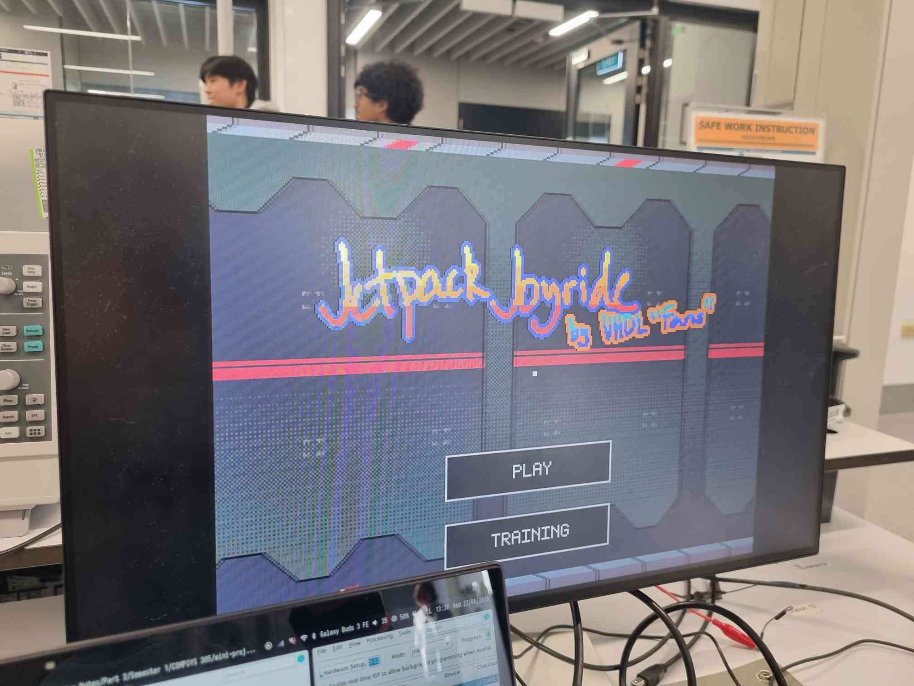
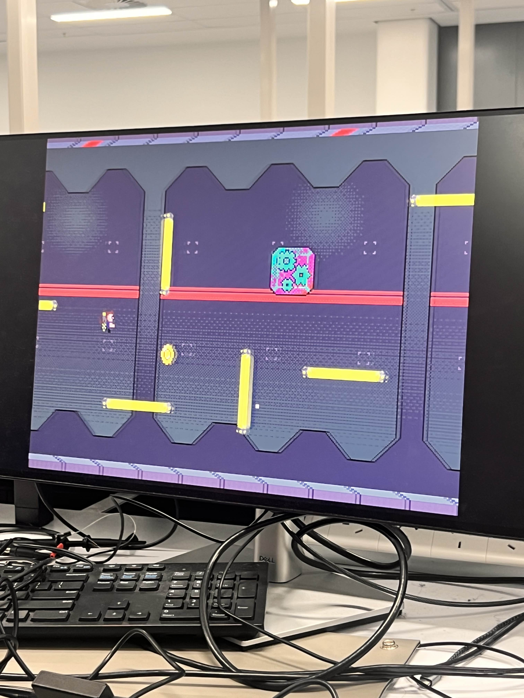

# Jetpack Joyride (FPGA)

An FPGA recreation of Jetpack Joyride.

## Highlights
- Side-scrolling runner with physics-driven player motion and collision detection.
- Modular sprite pipeline: independent render blocks for player, hazards, pickups, and UI.
- VGA video output with palette-driven assets for memory-efficient visuals.
- Deterministic game loop built around fixed-step timing and simple state machines.
- Randomized obstacle and pickup spawns via lightweight hardware PRNG.

## Screenshots

### Main screen

### Gameplay

## Board
- Targeted to the Terasic DE0-CV (Cyclone V) FPGA board.
- Uses the on-board 50 MHz clock and VGA output.
- Supports PS/2 mouse input for menu and gameplay control.

## Technical details
- Asset pipeline converts art into ROM-friendly formats and palettes.
- Hardware sprite compositing with priority rules for clean layering.
- Tileable backgrounds and realistic motion without large framebuffers.
- Top-level design splits timing, render, and game logic for clarity and reuse.
